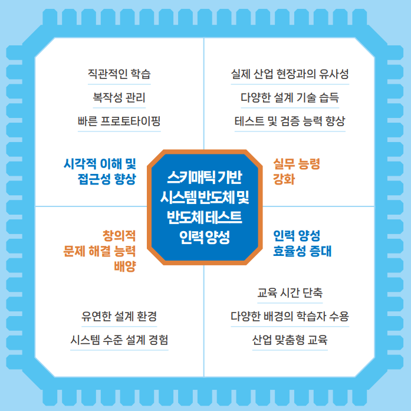
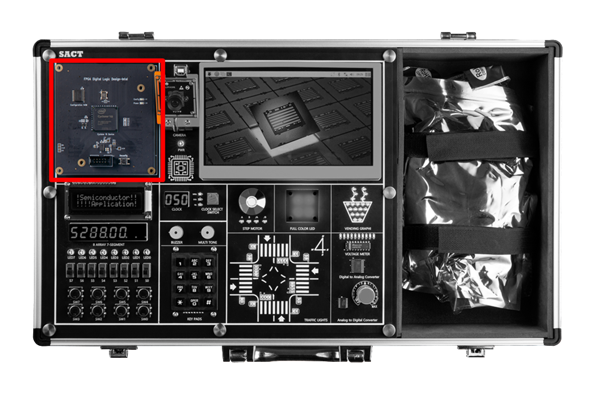
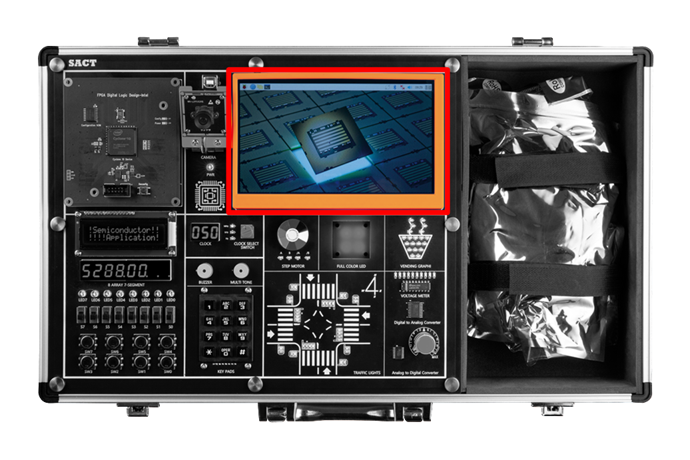

# 반도체 응용 회로 실습 장비 SACT

**Hanback Electronics SACT**

---

## SACT 

---

## 특징

SACT 장비는 아래와 같은 특징을 갖고 있다. 

- 하드웨어 동작을 자유롭게 정의할 수 있는 프로그래머블 반도체 실습장비

- 실습 지시서 운영에 필요한 터치 디스플레이와 카메라, 싱글 보드 컴퓨터(SBC) 제공

- 응용 회로 운영 클록에 필요한 16종의 클록 공급 기능 제공

- 응용 회로 실험에 필요한 주변장치(버튼, 텍스트 LCD, 키패드, 스탭모터, RGB-LED, 포텐셜미터등) 제공

- 센서 응용회로 설계 및 아날로그 신호 제어를 위해 ADC / DAC 제공

- 타이밍 분석기, 상태도 작성 도구, 시뮬레이션 환경 등 다양한 설계 툴 기반 전문적 설계 환경 제공

- 초보자도 쉽게 접근할 수 있도록 스키매틱 에디터만으로 회로 설계 지원

- 설계-구현-테스트 주기의 신속한 피드백을 통해 자신의 설계를 빠르게 검증하고 개선할 수 있음

- 설계한 회로를 빠르게 시뮬레이션하고 실습 장비에서 실험해 보는 단순화된 워크플로 제공

- 가산기, 감산기, 비교기, 멀티플렉서와 같은 주요 조합 논리 회로의 설계와 실습을 체계적으로 지원

- 래치와 플립플롭부터 레지스터와 카운터까지 점진적으로 난이도를 높여 학습

- 정밀한 타이밍 및 동기화 실습 가능

- 무어/밀리 머신과 같은 FSM 설계를 통해 복잡한 상태 기반 제어 논리 구현

- 메모리 설계 및 테스트 실습 가능

- 기본 논리 게이트부터 시작해 점진적으로 복잡한 조합 및 순차 논리 회로로 발전하도록 커리큘럼 지원

- 실제 반도체 설계 및 테스트 공정에서 사용되는 프로세스 간접 경험 가능

 

---

## 소프트웨어 환경 

- OS : Windows 10 이상

- Design Software
    - Schematic을 사용한 반도체 응용 회로 설계
    - 설계한 회로에 대한 시뮬레이션
    - 프로그래밍을 통한 하드웨어 동작 확인

 

---

## 블록 설명

### Semiconductor Application Circuit Design Block

Programable Logic Device에서 사용자가 반도체 응용 회로를 설계하고, 프로그래밍하여 하드웨어 동작을 확인해 볼 수 있는 블록

### Clock Control Block

   - 반도체 응용 회로 설계에서 사용하기 위하여 0Hz에서 50MHz까지 16단계로 구성된 클럭을 선택하여 사용.
    
   - 0Hz, 1Hz, 10Hz, 50Hz, 100Hz, 500Hz, 1kHz, 5kHz, 10kHz, 50kHz, 100kHz, 500kHz, 1MHz, 5MHz, 25MHz, 50MHz

### Input

   - Slide Switch 8ea
   - Push Button Switch 8ea	
   - 3 x 4 Keypads 1ea

 
### Output

   - Buzzer 1ea
   - Multi Tone Buzzer 1ea

 
### Display

   - 16 x 2 Text LCD
   - 4 Digit FND 2ea
   - LED 8ea
   - RGB LED 4ea 

  
### Actuator

   - Step Motor (Status LED 4ea)

 
### AD/DA Convertor

   - ADC : Parallel 8-bit, Sampling Speed 1MHz
   - DAC : Parallel 8-bit, Sampling Speed 500kHz
   - AD In : Volume Resistor(0-+5V)
   - Voltage meter : 0-+5V, Display LED 10ea

 
### Application Block

   - Traffic Light 
       - 32개의 LED를 이용해 네거리의 신호등을 표현 제어
       - 24개의 I/O 제어

   - Vending Machine Image
        - 20개의 LED를 이용해 컵에 물이 차는 모양 표시
        - 7개의 I/O 제어

            

### Assistance Block

   - x86 계열의 PC와 7인치 모니터, Camera로 구성됨.
        
   - 7인치 TFT LCD를 통해 수업 내용 표시		

 

   - Programmable Logic Device와 Assistance Block 연계 동작을 위한 Camera 데모

        

## 장비 Demo

- 아래와 같이 SACT 장비의 Programmmable Logic Device 모듈에 스위치를 Demo로 위치시킨다. 

>    Blank로 위치 시키면, Demo가 동작하지 않는다. 

- 아래와 같이 장비에 전원 케이블을 연결하고, 파워 스위치를 눌러 전원을 인가시킨다. 

- 아래와 같이 SACT 장비의 CLOCK 블록을 50MHz로 동작시킨다. 

    장비에서의 Demo는 50MHz를 기준으로 만들어졌으며, 다른 주파수에서는 더 느리게 동작하거나 동작이 안보일 수 있다.

- 앞에서와 같이 DEMO 스위치 설정과 CLOCK 50MHz 설정을 하고 장비에 전원을 인가하면, Demo가 동작한다. 

> 앞에서 설명한 것과 같이 Demo의 동작을 하지 않기 위해서는 Programmable Logic Device 모듈에서 Blank로 스위치를 설정하면 된다. 

- DEMO는 아래와 같이 동작한다. 

 

1. 8개의 LED에 PWM 제어에 의한 좌우 이동이 표시된다. 
 

  

2. 8개의 7-Segment에서 앞의 4개에(SEG7, SEG6, SEG5, SEG4) 초와 1/100초가 카운트된 값이 표시된다. 

 

  

3. 8개의 7-Segment 중 중간 2개에(SEG3, SEG2) Slide Switch(S7-S0)에서 설정한 값이 HEX 형태로 표시된다. 

 

 

4. 8개의 7-Segment 중 마지막 2개에(SEG1,. SEG0) 버튼 스위치(SW7-SW0)와 Keypad에 눌린 값이 표시된다. 

 

 

5. 버튼 스위치 SW3을 눌렀을 때에는 MultiTone Buzzer(PIEZO)에 3옥타브 라 음이 출력된다. 

 

 

6. 버튼 스위치 SW2를 눌렀을 때에는 Buzzer에 소리가 출력된다. 

 

 

7. Text LCD에 "Semiconductor / App. Circuit Kit"가 Display 된다. 

 

 

8. Step Motor가 시계 반대 방향으로 회전한다. 

 

 

9. RGB LED가 다양한 색을 Display한다. 

 

 

10. Vending Graphic 블록에서 잔에 물이 채워지는 동작을 반복한다. 

 

 

11. Traffic Light 블록에서 신호등의 동작을 한다. 

    버튼 스위치 SW1을 눌렀을 때, 차도 신호등에서 노랑색 불이 점멸된다. 

    버튼 스위치 SW0을 눌렀을 때, Toggle 형태로 차도 신호등에서 노랑색 불이 점멸된다. 

 

 

 

12.  VR을 조절하였을 때의 0-5V 값을 Analog to Digital Convertor로 읽어서, Digital to Analog Convertor로 전달된다. 

    이것은 Voltage Meter 블록의 10개의 LED를 통해 확인된다. 

 

 

13. TFT LCD의 Assitance Block에서 CAMERA 아이콘을 선택한다. 

    Slide Switch(SW7, SW6)에 의해 아래와 같이 화면에 표시된다. 

    
    |S7|S6||CAMERA DISPLAY MODE|
    |:-:|:-:|:-:|:-:|
    |0|0||NOT DISPLAY|
    |0|1||RGB Mode|
    |1|0||Grayscale Mode|
    |1|1||Canny Mode|

Not Display

 

RGB Mode

 

Grayscale Mode

 

Canny Mode

 

    

