## Tool Install
---

반도체 응용 설계 실습을 위해 사용하는 소프트웨어를 설치하는 방법이다. 

설계 소프트웨어는 altera의 Quartus Prime 소프트웨어이다. 

이 소프트웨어는 사용하는 목적에 따라 유료 버전과 무료 버전이 있는데, 여기에서 설명하는 버전은 무료버전인 Quartus Prime Lite이다. 

이 버전은 유료 버전과 사용하는 능력등의 차이는 없고, 지원되는 디바이스의 차이만 있다. 

또 아래에서도 설명하겠지만, 사용하는 버전은 Quartus Prime 20.1.1 Lite Edition Windows 버전이다. 

이 버전까지 시뮬레이터 소프트웨어로 ModelSim-Altera Edition을 지원하는데, 별도의 라이센스를 받는 부분이 없기 때문에 Quartus Prime 20.1.1 버전을 설치하여 사용하기 바란다. 

실제 FPGA의 설계 목적으로 사용하는 소프트웨어인데, 이 장비에서 반도체 응용 설계를 위한 목적으로 사용된다. 

(이 내용은 25년 6월에 작성되었으며, 날짜에 따라 홈페이지의 모양/접속 방법이 달라질 수 있다.) 

 

---
## 설치 파일 다운로드 및 설치

1. 홈페이지에 접속한다. [https://www.altera.com](https://www.altera.com)

   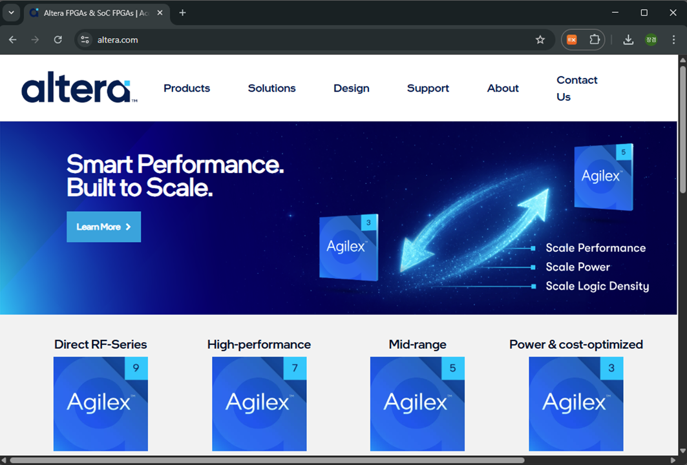    

2. 화면에서 Product > Development Software & Tools 메뉴를 선택한다.

   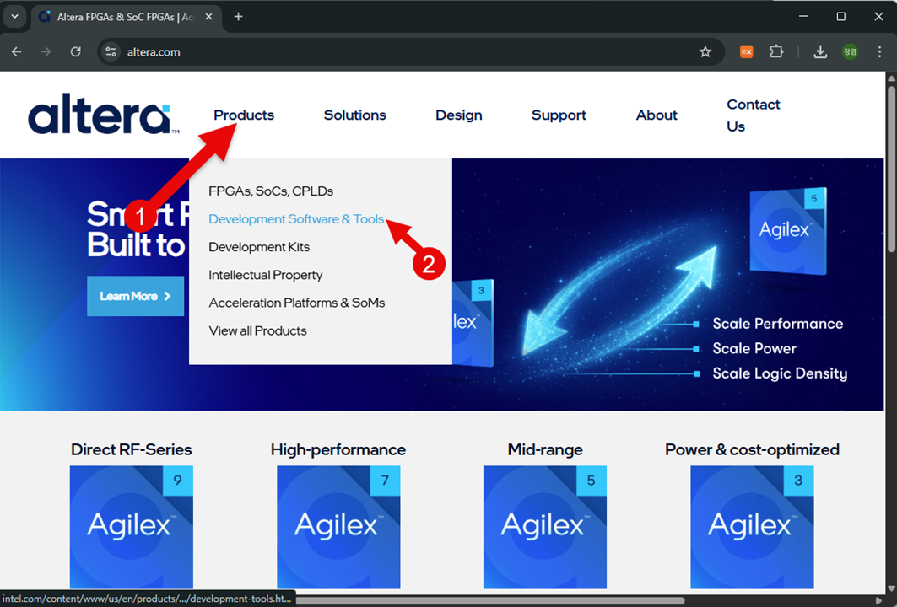    

3. 화면에서 Design Tools의 Quartus Prime Design Software 메뉴를 선택한다. 

   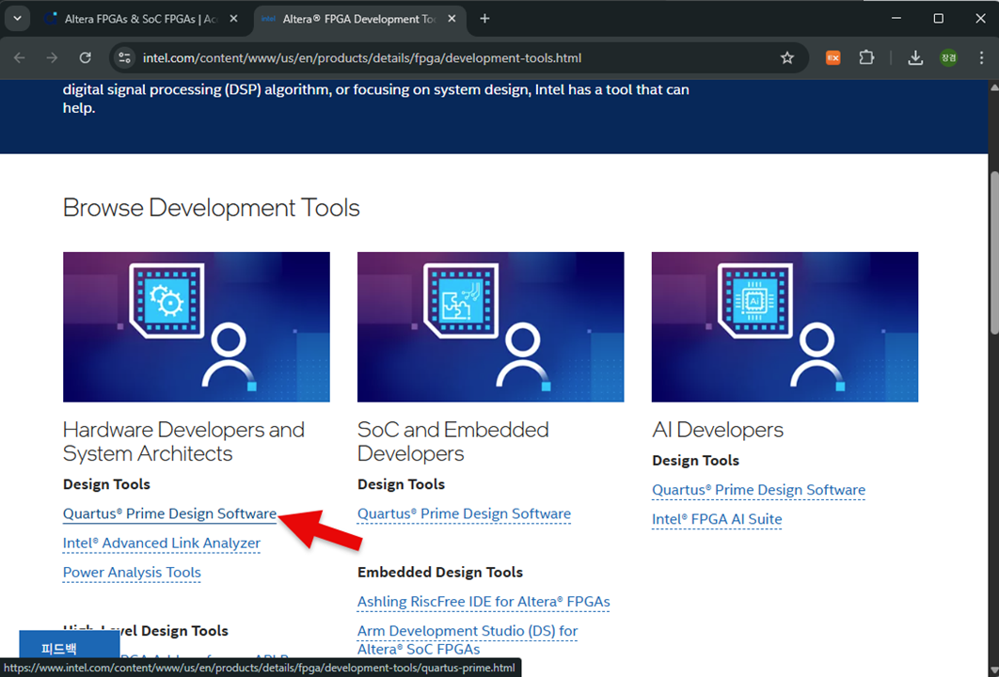    

4. Downloads 메뉴를 선택한 후, Lite Edition의 Go to Download 메뉴를 선택한다. 

   Lite Edition이 무료 소프트웨어이다. 

   단, 디바이스의 제한이 있고 라이선스는 별도의 설정이 없이 1년간 사용할 수 있습니다. 필요하면 재설치 하면 된다. 

   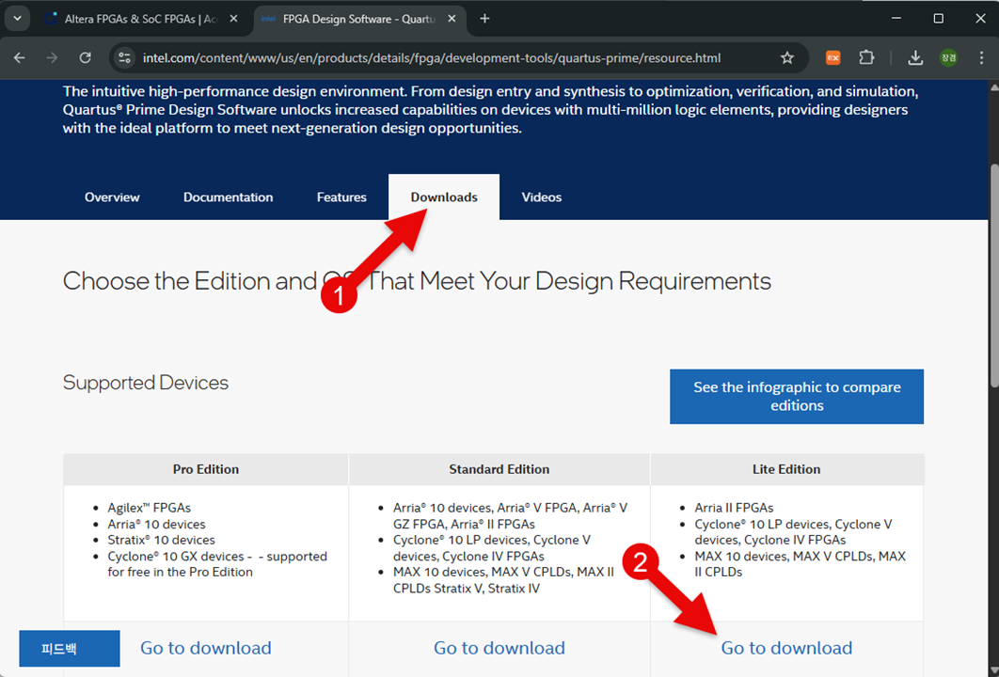    

5. 다운로드 받을 버전을 20.1.1로 선택한다. 

   이것은 시뮬레이션 소프트웨어를 ModelSim으로 하기 위한 목적이다. 

   그 이상의 소프트웨어를 사용할 경우에는 별도의 License의 설정이 필요하기 때문에 이 20.1.1 버전을 반드시 설치하셔야 한다. 

   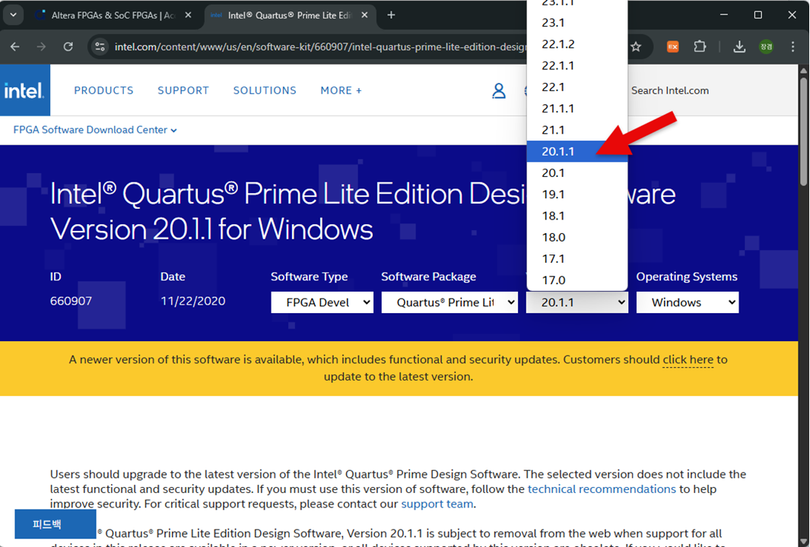    

6. Multiple Download의 Download를 선택하여 소프트웨어를 Download 받습니다. 

   다운로드 받는 총 용량은 5.9GB 이다. 

   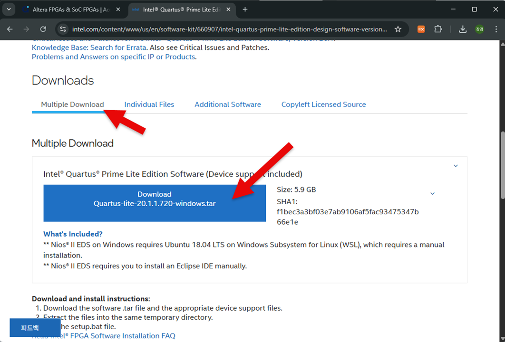   

7. Download 받으면 Chrome의 경우 아래 그림과 같이 창의 오른쪽 위부분에 download history에이 파일이 나타난다. 

   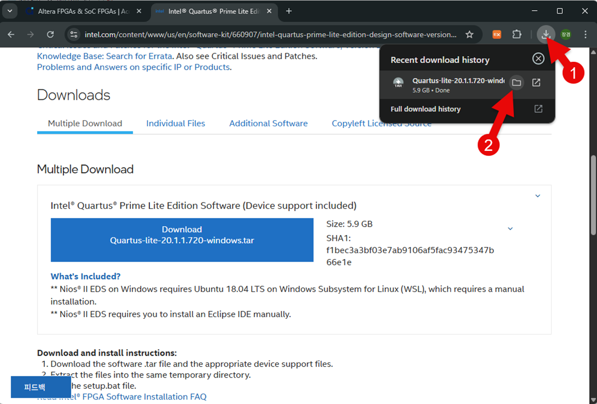   

8. 다운로드 받은 Quartus-lite-20.1.1.720-windows.tar 파일의 압축을 풀고, setup.bat 파일을 실행시켜 설치를 진행한다. 

   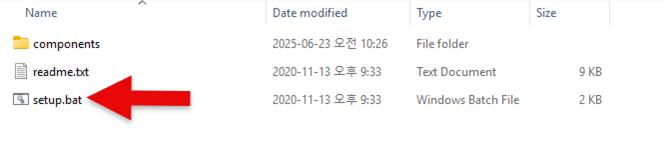   

9. 설치를 하면, 다음과 같은 License Agreement 창이 나타나는데, I accept the agreement를 선택 후, Next 버튼을 누른다. 

   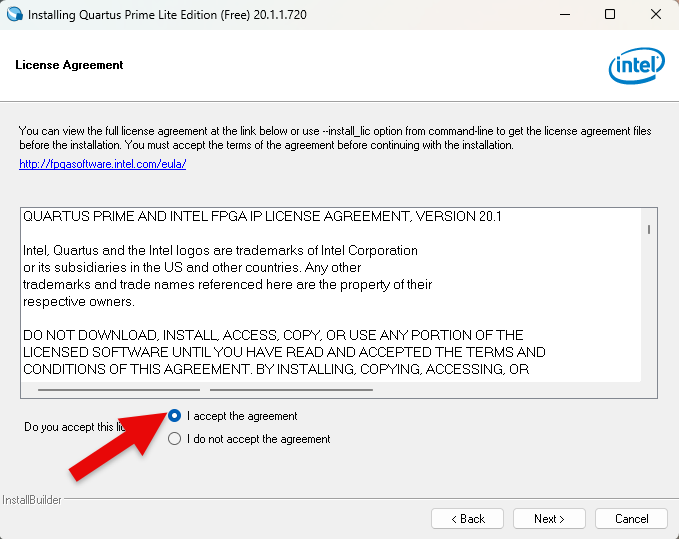   

10. 다음은 소프트웨어 설치하는 위치이다. 아래 그림과 같이 기본 설정 위치에 설치한다. 

   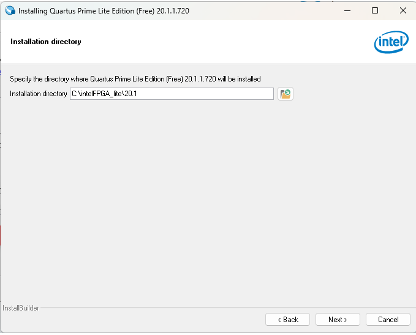   

	
11. 다음은 설치하는 Components를 선택하는 화면이다. 하드디스크의 용량이 많으면 다 설치하셔도 되지만, 아래 그림과 같이 Quartus Prime Help / Cyclone IV / Cyclone 10LP / Modelsim-IntelFPGA Starter Editon(Free)를 선택한다. 

   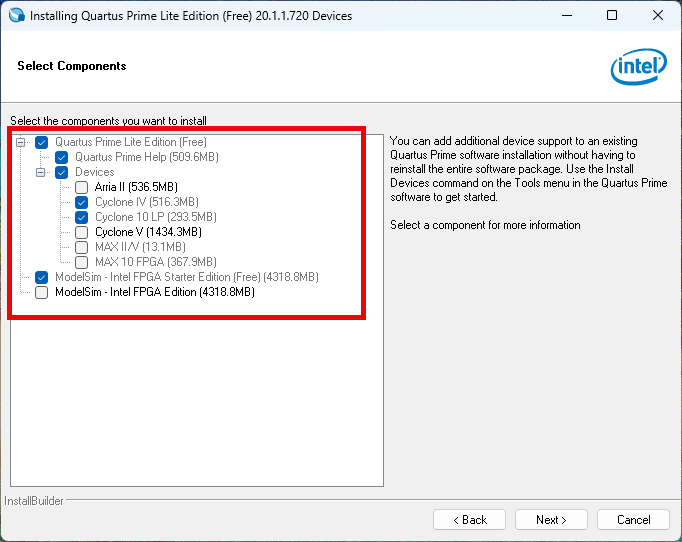 

	
12.  위에서 Next를 누르면 소프트웨어 설치가 진행된다. 
	
   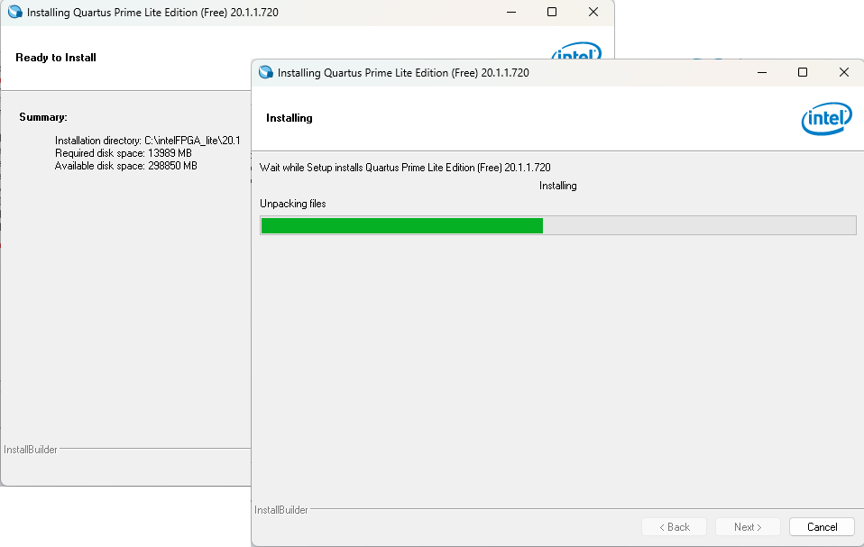   
	

13.  설치가 완료되면 아래의 창이 나타나는데, Finish를 눌러 소프트웨어의 설치를 끝마치고, USB Blaster II의 드라이버를 설치한다.
   
 
     여기에서 USB Blaster는 프로그래밍 하드웨어 장치이다.

   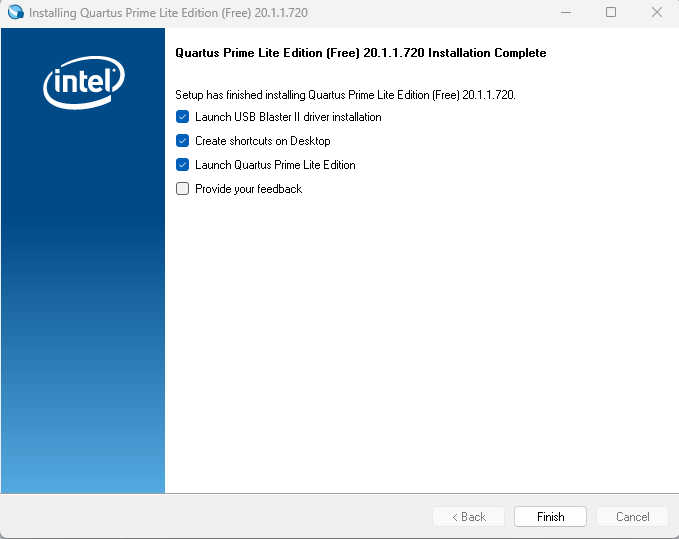  
	

14.  다음과 같이 USB Blaster II 드라이버를 설치한다. 
	

   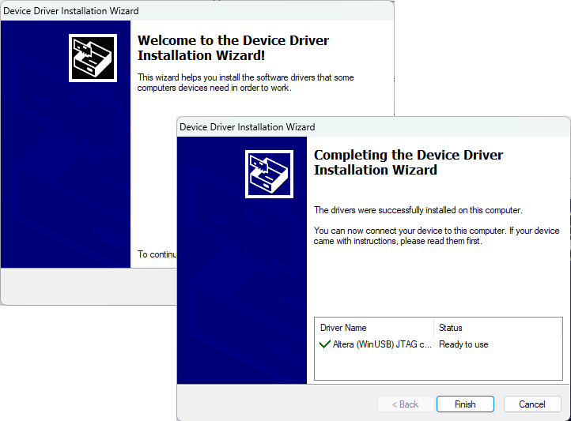 
	

15.  드라이버 설치를 끝마치면 Quartus Prime 소프트웨어가 실행되는데, 최초 1회에 한해서 아래의 그림처럼 Run the Quartus Prime software를 선택한다. 

   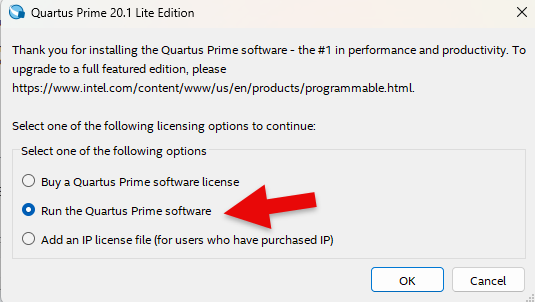 
	
   

16.   아래는 Quartus Prime이 실행되었을 때의 첫 화면이다. 
		
   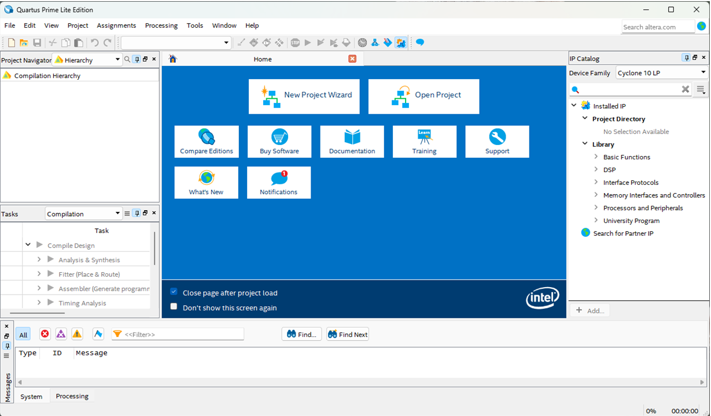	 

