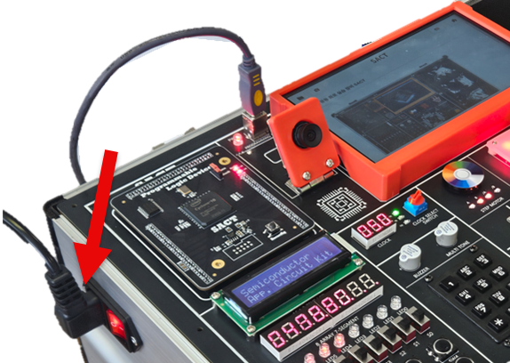
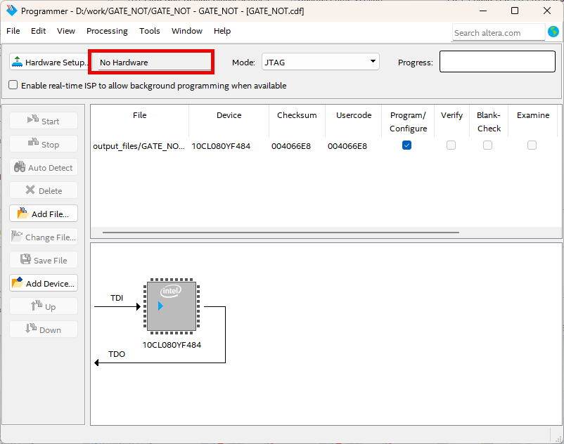

## Getting Started
---

이전 장에서 설명하여 설치했던 Quartus Prime Lite Edition을 기본적으로 사용하는 방법에 대해 설명하겠다. 

Quartus 소프트웨어를 사용하기 위해서는 아래의 과정을 거쳐야 한다. 

   1. 프로젝트 생성 
   2. 로직 설계
   3. 문법 검사(Functional Compiler)
   4. Device & Pin Assignment
   5. 컴파일( Place & Route / Timing Anayzer / Generate Programming File)
   6. Simulation (Functional / Timing)
   7. 하드웨어 동작 확인(Programming)

이 교재에서는 위와 같은 과정을 모두 하지 않고, Digital Logic 실습이라는 부분을 더 많이 확인 할 수 있도록 아래와 같은 과정으로 간략화 하였다. 물론, 뒤의 프로젝트 실습에서는 모든 과정을 직접 하도록 구성되어 있다. 

   1. 프로젝트 열기
   2. 로직 설계 (회로에서 논리 게이트만 추가 / 연결)
   3. 컴파일
   4. 시뮬레이션 ( Functional Simulation )
   5. 하드웨어 동작 확인 (Programming)

이 절에서는 Getting Started로 Quartus 소프트웨어를 사용하여 기본적인 회로를 구성하여 검증하는 과정을 모두 설명하는 내용을 설명하고있다. 

 

---

## 프로젝트 설정

아래의 과정을 통해 프로젝트를 설정한다. 

1. Quartus Prime Lite Edition 소프트웨어를 실행시킨다. 

     

2. File > New Pro0ject Wizard 메뉴를 선택하여 새로운 프로젝트 파일을 생성한다. 

     

3. 아래 그림과 같이 나타나는 Introduction 메뉴는 Next 버튼을 눌러 다음으로 넘긴다. 

     

4. 아래 그림과 같이 Project의 작업 공간과 Project Name등을 설정하는 부분에서 다음과 같이 설정한다. 
   
   대소문자를 구별하는 것에 유의해야 한다. 

     

   |Description |Data|
   |:-|:-|
   |Working directory | d:\work\GS|
   |Project Name | GS |
   |Top Level Design Edtity Name | GS|

 

5. 위에서 Next 버튼을 누르면 아래 그림과 같이 새로운 Directory를 만들 것인지를 묻는데, Yes를 선택한다. 

     

6. 아래 그림과 같이 Project Type를 선택하는 부분에서는 Empty Project를 선택한다. 그리고, Next 버튼을 누른다. 

     
   
7. 추가할 파일에 대한 설정은 다른 설정을 하지 않고, Next 버튼을 누른다. 

     

8. 실제 하드웨어에 프로그램하여 동작 실험하는데 사용할 Programmable Logid Device(FPGA)에 대한 디바이스명을 설정하는 부분이다. 

   정식 명칭은 10CL080YF484C8G 모델인데, 디바이스의 종류가 많기 때문에 쉽게 설정하기 위해서 아래 그림과 같이 항목을 선택한다. 

   |Device Family | Cyclone 10LP|
   |:-|:-:|
   |Package |FBGA|
   |Pin Count |484|
   |Core speed grade | 8|
   |Device |10CL080YF484C8G|

    

     

9. EDA Tool Setting은 다른 설정 하지 않고, Next 버튼을 누른다. 

     

10. 지금 설정한 프로젝트 정보를 확인한 후, Finish 버튼을 눌러 프로젝트 생성을 마무리 한다. 
     

---

## Logic Design

11. 프로젝트의 생성이 완료되면, 아래 그림과 같이 프로젝트가 설정된 부분이 나타난다.   
     

12. 새로운 디자인 파일을 생성하기 위해서, 아래 그림과 같이 File > New 메뉴를 선택한다.   
     

13. 아래 그림과 같이 New 창에서 Block Diagram/Schematic Files 항목을 선택하여, 심볼에 의한 설계를 선택한다.   
       
     

14. 아래 그림과 같이 도면 부분을 마우스로 더블 클릭하거나, 도면 부분에서 마우스의 오른쪽 버튼을 클릭하여 나타나는 메뉴에서 Insert > Symbol 메뉴를 선택한다.  

     

15. 심볼 입력 창에서 4count 라는 심볼명을 입력하고, OK 버튼을 누른다. 그리고, 도면의 적당한 곳에 위치시켜준다.   
      
     

16. 같은 방법으로 심볼 입력 창을 나타낸 후, input와 output의 심볼명을 입력하여, input과 output을 추가해준다.   
      
      
      

17. 아래 그림과 같이 input과 output 심볼에서 pin_name1 또는 pin_name2라고 되어 있는 부분을 마우스로 더블 클릭하여 나타나는 Pin Properties 창에서 Pin name을 각각 CLK , Q[3..0]으로 입력한다.  
      
      
      

18. 다음은 wire를 이용해 심볼과 심볼을 연결시켜주는 방법이다.   
   아래 그림과 같이 심볼의 끝 부분으로 마우스 포인터를 위치시키면, 마우스 포인터가 + 표시고 바뀌는데 이 때 마우스 버튼을 드래그 & 드롭해서 심볼과 심볼을 연결시킨다.   
      
      
   
19. wire로 연결하는 방법외에 NET 이름으로 연결하는 방법이 있다. 아래 그림과 같이 4count의 출력 QA, QB, QC, QD에 각각 wire를 추가한 후 NET NAME을 Q0, Q1, Q2, Q3으로 설정한다.  
   NET NAME은 wire를 그린 후 바로 Q1등을 입력하거나, 나중에 wire를 선택하고 Q1등의 이름을 입력하면 된다.    
      
      
      

20. 앞에서 output의 이름을 Q[3..0]으로 한 이유가 Q0, Q1, Q2, Q3을 1비트 wire를 4비터 bus 포트로 설정하기 위한 것이다.   
      
   
21. File > Save 메뉴를 선택하여 설계한 파일을 저장한다.   저장하기 전에는  초기 값인 Block.bdf로 파일명이 나타나고 있다.    
      
   저장할 때에는 아래 그림과 같이 현재 프로젝트 명으로 저장할 것을 권유하는데, SAVE 버튼을 눌러 저장한다.   
      
      

---

## Functional Compile

22. Processing > Start > Start Analysis & Elaboration 메뉴를 선택해서 문법적인 오류가 없는 지를 검사하는 컴파일을 진행한다.    
      

   만약에 오류가 있다면 아래 그림과 같은 에러 메시지가 발생하며 오류를 해결한 후, 다시 컴파일을 한다.   
   
   참고로 아래 오류는 input 심볼과 4count 심볼 사이의 CLK라인이 연결되지 않았기 때문이다. 연결을 잘 해주면 해결된다. 

      

---

## Device & Pin Assignment 

23. 문법에 오류가 없다면, 테스트할 하드웨어에 대한 디바이스와 핀에 대한 설정을 해야 한다.   
   Programmable Logic Device는 Power / JTAG / 입력 전용핀 등의 특정이 있는 핀을 제외한 모든 I/O 핀을 사용자 임의로 정의하여 사용할 수 있다.  현재 SACT 라는 장비를 이용해서 하드웨어의 테스트를 하기 때문에 고정된 디바이스와 핀을 설정해야 한다.   

24. Assignment > Device 메뉴를 선택하여 디바이스에 대한 설정을 진행한다.   
         

25. 디바이스 명은 앞에서 설정한것 처럼 Cyclone 10LP Family의 10CL080YF484C8 이다.   
         

      >|Cyclone 10LP | 10CL080YF484C8G |
      >|:-:|:-:|
   

    설정한 디바이스명이 다르면, 장비에 다운로드가 되지 않기 때문에 디바이스 설정에 주의해야 한다.   

26. 아래 그림과 같이 Device 설정 창에서 Device and Pin Opiton 버튼을 누른다.   
      

27. Device and Pin Options 창에서 아래 그림곽 같이 Category Unused Pins 항목의 Reserve all unused pins 부분을 As output driving ground 항목으로 선택한다.   
   이것은 나중에 장비로 다운로드하여 동작시킬 때, 설정하지 않은 핀을 GND 즉 0으로 하여, 동작 테스트에 혼동이 되지 않도록 하는 부분이다.  
   기본 값인 As input tri-state with weak pull-up 상태의 경우 사용하지 않은 핀을 약한 pull-up 상태로 설정하는 것으로, 이렇게 하면 사용하지 않은 핀들의 값이 1이 출력된다.   
   이렇게 되면 사용하지 않은 나머지 LED에 불이 들어와서 동작 확인하는데 혼동이 생기기 때문에, 사용하지 않은 핀들을 GND로 출력하도록 설정하는 것이다.   
      

28. 아래 그림과 같이 Assignment > Pin Planner를 선택하여, 핀 설정을 진행한다. 
      
      

29. Pin Planner 창에서 아래 그림의 부분이 사용하는 디바이스의 Pin out을 나타나낸 부분이다. 이 중 O 부분이 User I/O로 사용자가 임의로 정의하여 설계한 로직의 입출력 포트에 해당하는 핀 번호를 설정하는 것이다.   
      

   아래 부분의 Node Name 의 Location에 아래 표에서 설명하는 핀 번호를 설정한다.  
   이것은 SACT 장비에서 동작을 확인하기 위한 입력 Buttion Switch와 출력 LED의 핀 번호이다.   
   
   >|Port Name||CLK|Q3|Q2|Q1|Q0|
   >|:-:|:-:|:-:|:-:|:-:|:-:|:-:|
   >|Device||SW7|LED7|LED6|LED5|LED3|
   >|Pin Number||W8|W2|Y1|Y2|Y3|
   
    

   아래 그림과 같이 각 입출력 포트의 Location의 부분을 마우스로 클릭한 후, 각 장치에 대한 핀 번호를 적는다.  
   예를 들어 Button Switch SW7에 해당하는 W8을 적으면 되는데, 이러면 자동으로 앞에 PIN_ 부분이 붙어 PIN_W8이 된다.   
      
   
30. 핀 설정도 디바이스 설정과 같이 주의해야 한다. 다른 핀으로 핀을 설정하면, 내가 원하는 결과가 하드웨어로 나타나지 않을 수 있기 때문이다.   
   Pin Planner 창을 닫는다. SAVE 등을 하지 않아도 설정한 내용이 자동 저장된다.   

---

## Compile

31. 앞에서 설정한 디바이스 / 디바이스 옵션 / 핀 설정 등을 포함하여 컴파일 한다.  
   설정이 잘못 되었는지 확인하고, 설정된 하드웨어 사항을 반영하여 시뮬레이션하기 위한 Timng 파일과 Programmiong 파일을 만드는 부분이다.   

32. 앞에서 한 Processing > Start Compilation 메뉴를 선택하여 컴파일을 진행한다.   
      
      
   
33. 컴파일은 아래 그림과 같이 몇 단계의 과정을 거치게 된다.   
   - Analysis & Synthesis : Logic Gate로 작성한 논리 회로를 분석하고, 합성하는 과정
   - Fitter(Place & Route) : 위에서 합성한 내용을 바탕으로 Chip의 기본 단위인 Logic Cell로 변환하고, Logic Cell을 서로 연결하는 과정
   - Assembler(Generate Programming File) : Chip에 다운로드 하기 위해 프로그래밍 파일을 만드는 과정
   - Tiimig Analysis : 선택한 Chip에 대한 지연 시간등의 Timing 정보를 생성하는 과정
     
      

## Functional Simulation

34. 시뮬레이션은 하드웨어의 동작 결과를 소프트웨어 상에서 예측해보고자 하는 부분이다.  
   아래 그림과 같이 File > New 메뉴를 선택하고, 나타나는 New 창에서 Verification / Debugfging Files > University Program VWF를 선택한다.   
      
      

35. 아래 그림은 이 University Program VWF를 선택했을 때 나타나는 Simulation Waveform Editor 창이다.  
      

36. 시뮬레이션하는 입출력 포트를 추가하기 위해서 아래 그림과 같이 화면을 마우스 오른쪽 버튼을 누르고, Insert Node or Bus 메뉴를 선택한다.   
      

37. 아래 그림과 같이 Insert Node or Bus 창에서 Node Finder 버튼을 누른다.   
      

38. 아래 그림과 같이 (1)List 버튼을 누르면, Nodes Found에 (2)와 같은 입출력 포트가 나타난다. (3) >> 버튼을 눌러 Selected Nodes로 입출력 포트가 이동(4)하도록 한다. 그리고, OK 버튼을 누른다.   
      

39. 아래 왼쪽과 같이 Insert Node or Bus 창이 다시 나타나면 OK 버튼을 누른다. 그리면 아래 오른쪽과 같이 Waveform Editor창에 입/출력 포트가 추가된다. 
      

40. 시뮬레이션의 입력 조건을 주기 위해 아래 그림과 같이 CLK의 Waveform 부분을 마우스로 드래그(1)하여  선택하고 위츼 1 아이콘을 눌러(2) 1의 값을 입력한다.  
   이런 방법으로 CLK 입력 조건을  설정한다.   
      
      

41. File > Save 메뉴를 선택하여 저장한다. 저장할 파일명은 기본 값으로 한다.   
      
      

42. Simulation > Run Functional Simulation 메뉴를 선택하여 Functional Simulation을 진행한다.   
      

43. 아래와 같은 에러 메시지가 나타날 것인데, 이것은 소프트웨어에서 미리 설정된 옵션에 오류가 있어서 나타나는 메시지이다.   
      

   아래와 같이 Simulation > Simulation Settings 메뉴를 눌러 설정창을 불러온다. 
      

44. 아래와 같이 설정창에서 -novopt 부분을 지우고 Save 버튼을 눌러 저장한다.   
      

45. 다시 Simulation > Run Functional Simulation 메뉴를 선택하여 Function Simulation을 진행한다.  
   결과를 확인하면 아래 그림과 같다. 화면에서 화살표 방향에 있는 Q의 부분을 마우스로 클릭해 주면 Bus 데이터가 확장되어 비트 데이터도 같이 출력된다.   
  
      

---
## Hardware Test(Programming)

46. 장비를 이용해 하드웨어 동작 테스트를 위해서, SACT 장비를 준비한다. 

47. 장비의 중앙 위쪽의 USB B Type Connector에 USB 케이블을 PC와 연결한다. 

 

48. 장비의 왼쪽 Power Connector에 전원 케이블을 연결하고, 전원 스위치를 눌러 장비에 전원을 인가시킨다. 

 

49. Quartus 소프트웨어에서 Tool > Programmer 메뉴를 선택한다.

 

50. 앞의 그림과 같이 Programmer창의 Hardware Setup  부분이 No Hardware로 되어 있다면, 장비와 PC간에 USB 케이블이 바르게 연결되어 있는지 확인하고 Hardware Setup 버튼을 눌러, USB Blaster를 선택한다. 

 

 

51. 아래 그림과 같이 USB Blaster가 연결되어 있다면, Start 버튼을 눌러 프로그래밍 하고 장비에서 NOT 게이트의 동작을 확인한다. 

 

52. 버튼 스위치를 동작시키고, LED를 통해 결과를 확인해 보자.

   >|Port Name||CLK|Q3|Q2|Q1|Q0|
   >|:-:|:-:|:-:|:-:|:-:|:-:|:-:|
   >|Device||SW7|LED7|LED6|LED5|LED3|
   >|Pin Number||W8|W2|Y1|Y2|Y3|

