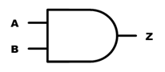
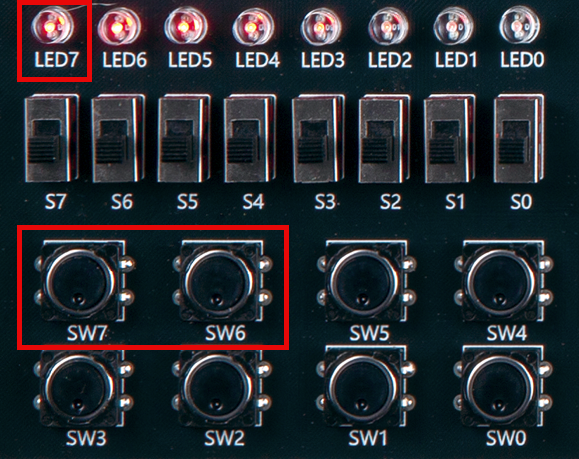
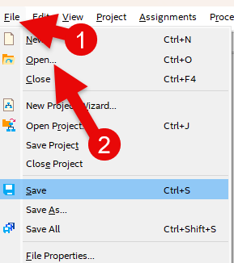
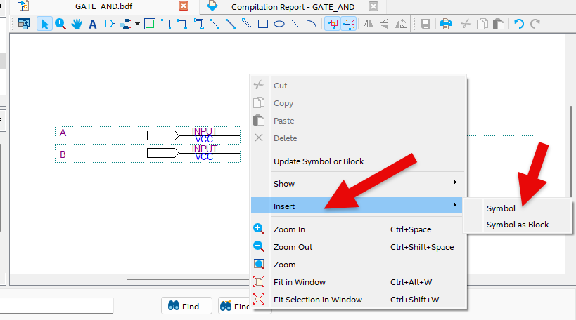
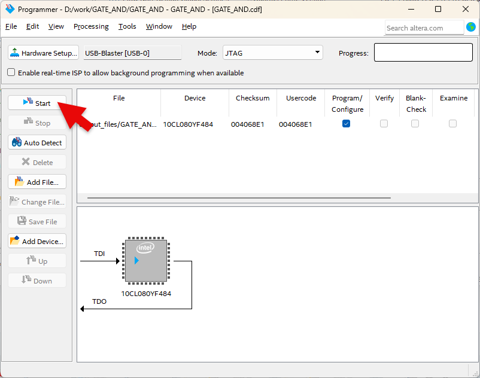

# AND Gate
---
## 이론

AND 연산은 1(High)과 0(Low) 사이의 일반 곱셈과 같이 수행된다.

다음 그림은 2입력 AND 게이트의 논리 기호이다. AND 게이트의 출력은 논리 입력의 곱과 같다. 

AND 게이트는 모든 입력이 High일 때만, 출력이 High가 되는 회로이다. 

입력 중 하나라도 Low이면 Low값이 출력된다. `

 

 

AND 연산 진리표
|A|B|Z = AB|
|:---:|:---:|:---:|
|0|0|0|
|0|1|0|
|1|0|0|
|1|1|1|

 

동작 파형

 

---
## **실습 목표**

다음의 회로를 설계하여 실험해 보자.

 

 

이 회로의 동작 진리표은 다음과 같다. 

|A|B|Z = AB|
|:---:|:---:|:---:|
|0|0|0|
|0|1|0|
|1|0|0|
|1|1|1|

 

SACT 장비에서 확인하기 위하여 연결된 장치는 다음과 같다. 

|A|B|Z|
|:---:|:---:|:---:|
|SW7|SW6|LED7|

 

 

### **설계**

1. 실험을 위해 프로젝트 파일 <a href="./pds/GATE_AND.zip" download>GATE_AND.zip</a>을 준비한다. 

 

2. 다운로드된 프로젝트의 압축 파일을 d:\work에 이동시킨 후, 압축을 푼다.

3. Quartus II를 실행키고, File> Open Project 메뉴를 선택한다. 

 

4. 위에서 압축을 푼 위치인, d:\work\GATE_AND 폴더로 이동 후,GATE_AND 프로젝트를 OPEN한다. 

 

5. File > Open 메뉴를 선택하여 GATE_AND.bdf 파일을 불러오거나, 프로젝트 왼쪽의 GATE_AND 부분을 마우스로 더블 클릭한다. 

 

6. 아래 그림과 같이 미완성된 도면이 보이는데, 실습 목표에서 설명한 도면으로 완성시키자. 

 

 

7. 도면을 더블 클릭하거나, 마우스 오른쪽 버튼을 누르고 Insert > Symbol 메뉴를 선택한다. 

 

8. 심볼 창에서 왼쪽 아래 부분의 -Name- 부분에 and2이라고 심볼명을 입력하고, OK 버튼을 누른다. 

 

9. AND 게이트 심볼을 도면에 위치시키고, wire로 심볼을 연결시켜 회로를 완성시킨다. 
 
회로의 Wire가 정확하게 연결되지 않았을 경우에는 원하는 동작이 되지 않을 수 있기 때문에 주의하자. 

 

 

### **컴파일**

10. File > Save 메뉴를 선택하여 저장하고, Processing > Start Compilation 메뉴를 선택하여 컴파일을 진행한다. 

이 컴파일 과정은 설계한 논리 회로에 오류가 없는 지를 검증하고, 프로그래밍 파일과 시뮬레이션 파일을 만드는 과정이다. 

  

11. 아래 그림은 컴파일이 진행되어 완료된 상태이다.  

 

 

### **시뮬레이션**

12. 아래 그림과 같이 File > Open 메뉴를 선택하고, 나타나는 Open File 창에서 오른쪽 아래 부분의 File Type을 All File(*.*)로 변경한 후, Waveform.vwf 파일을 선택한다. 

 

13. 아래 그림과 같이 Waveform 창에서, Simulation > Run Functiona Simulation 메뉴를 선택하여 Functional Simulation을 진행한다. 

 

14. 아래 그림은 시뮬레이션 한 결과이다. 앞의 실험 목표에서 설명한 진리표와 맞게 시뮬레이셔 되었는지 확인한다. 

 
 

### **하드웨어 동작 확인**

15. SACT 장비를 준비한다. 

16. 장비의 중앙 위쪽의 USB B Type Connector에 USB 케이블을 PC와 연결한다. 

17. 장비의 왼쪽 Power Connector에 전원 케이블을 연결하고, 전원 스위치를 눌러 장비에 전원을 인가시킨다. 

18. Quartus 소프트웨어에서 Tool > Programmer 메뉴를 선택한다.

 

19. Programmer창의 Hardware Setup이 USB Blaster가 연결되어 있는지 확인하고, Start 버튼을 눌러 프로그래밍 하고 장비에서 AND 게이트의 동작을 확인한다. 

 

22. 버튼 스위치를 동작시키고, LED를 통해 결과를 확인해 보자.

|A|B|Z|
|:---:|:---:|:---:|
|SW7|SW6|LED7|

  

 

