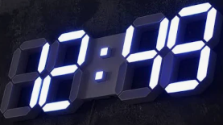
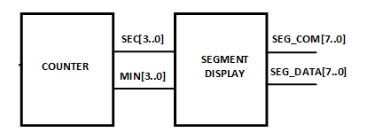

# WATCH
---

## 기획

분과 초 가 표시되는 디지털 시계를 설계해 보자. 

시계는 일반적으로 아래 그림과 같이 시와 분이 표시된다. 

 

 

장비에서 동작시키기 위해서 좀 더 빠르게 변화할 수 있는 분과 초가 표시되는 시계를 만들어 보자.

시계의 설계는 아래 그림과 같이 COUNTER 블록과 SEGMENT DISPLAY블록으로 나누어 설계된다. 

  

COUNTER 블록은 1초 주기의 CLOCK을 받아서 초와 분을 카운트한다. 

SEGMENT DISPLAY 블록은 COUNTER 블록에서 출력하는 초와 분의 BCD 값을 입력 받아, 7-SEGMENT ARRAY에 표시하는 블록이다. 

