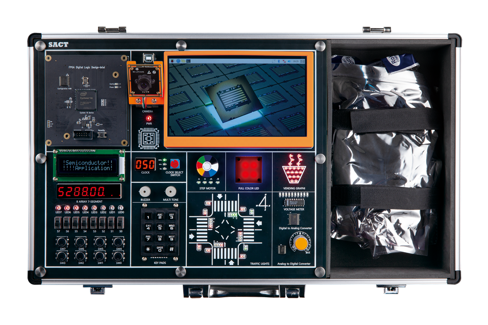
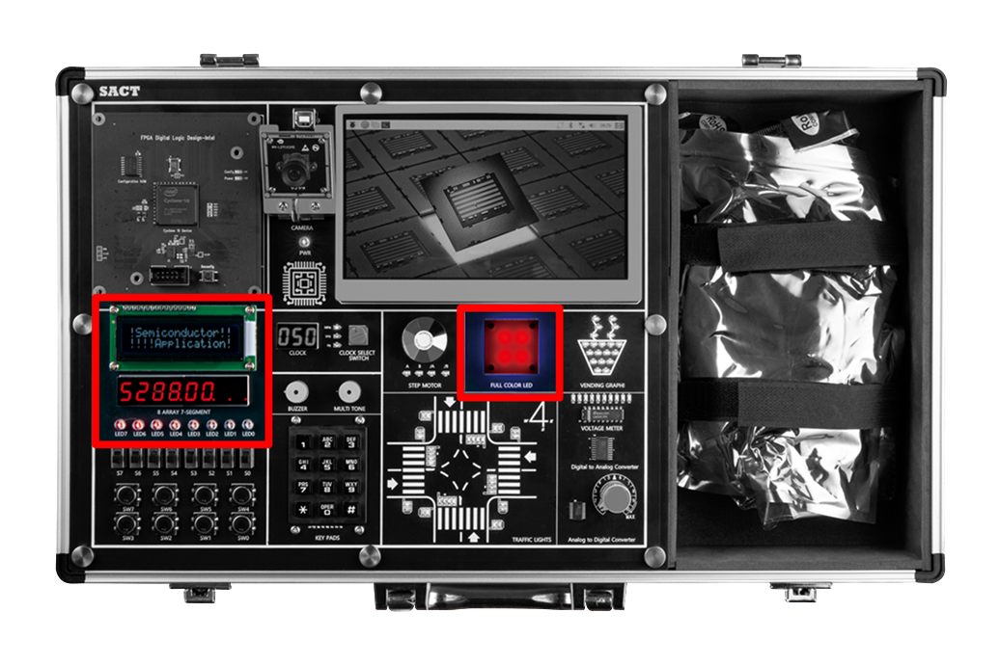

# 반도체 응용 회로 실습 장비 SACT

Hanback Electronics SACT

---

## SACT 

---

## 블록 설명

### 1. Semiconductor Application Circuit Design Block

Programable Logic Device에서 사용자가 반도체 응용 회로를 설계하고, 프로그래밍하여 하드웨어 동작을 확인해 볼 수 있는 블록

### 2. Clock Control Block

- 반도체 응용 회로 설계에서 사용하기 위하여 0Hz에서 50MHz까지 16단계로 구성돈 클럭을 선택하여 사용.

- 0Hz, 1Hz, 10Hz, 50Hz, 100Hz, 500Hz, 1kHz, 5kHz, 10kHz, 50kHz, 100kHz, 500kHz, 1MHz, 5MHz, 25MHz, 50MHz

|PORT NAME|CLK|
|:-:|:-:|
|HARDWARE|Main Clock|
|PIN NUMBER|G2|

 

### 3. Input
- Slide Switch 8ea
- Push Button Switch 8ea	
- 3 x 4 Keypads 1ea

 

#### (1) Slide Switch 

#### (2) Button Switch 

#### (3) KEYPADS

 

### 4. Output
- Buzzer 1ea
- Multi Tone Buzzer 1ea

5. Display
- 16 x 2 Text LCD
- 4 Digit FND 2ea
- LED 8ea
- RGB LED 4ea 

  
 
 
### 6. Actuator
- Step Motor (Status LED 4ea)

 
 
 
### 7. AD/DA Convertor
- ADC : Parallel 8-bit, Sampling Speed 1MHz
- DAC : Parallel 8-bit, Sampling Speed 500kHz
- AD In : Volume Resistor(0 ~ +5V)
- Voltage meter : 0 ~ +5V, Display LED 10ea

 
### 8. Application Block
- Traffic Light 
    - 32개의 LED를 이용해 네거리의 신호등을 표현 제어
    - 24개의 I/O 제어

- Vending Machine Image
    - 20개의 LED를 이용해 컵에 물이 차는 모양 표시
    - 7개의 I/O 제어

        

 
 
### 9. Assistance Block

- x86 계열의 PC와 7인치 모니터, Camera로 구성됨.
    
- 7인치 TFT LCD를 통해 수업 내용 표시		

 

- Camera를 통한 AI 실험 데모

        

