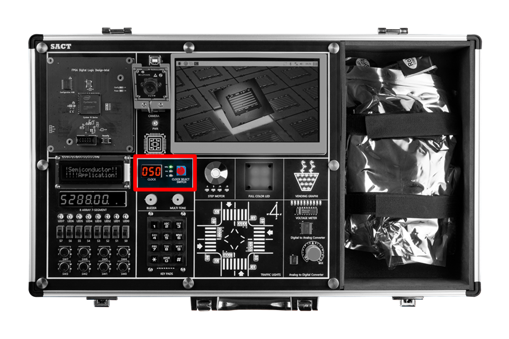
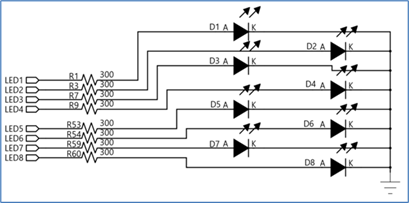
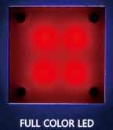
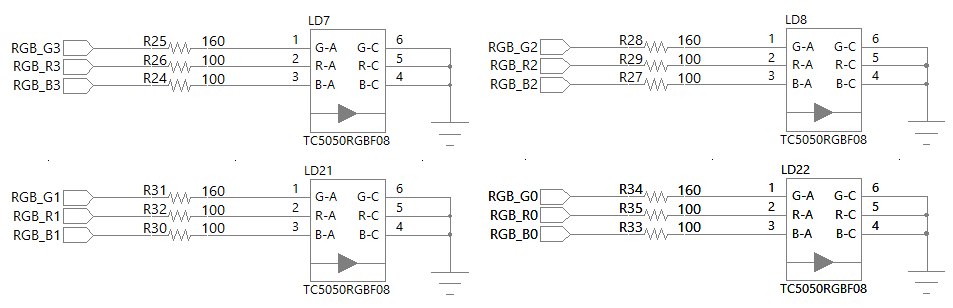
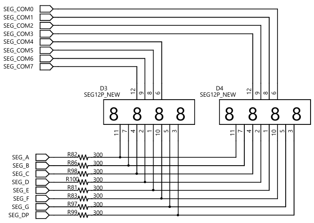
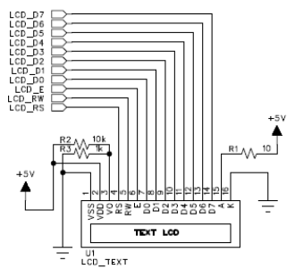
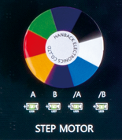
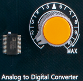
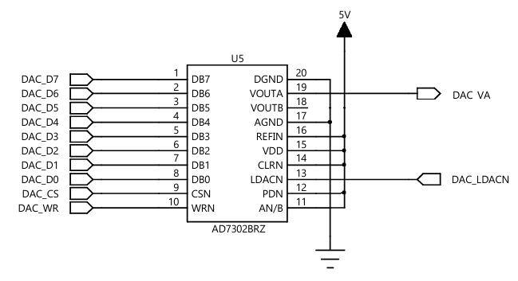

# 반도체 응용 회로 실습 장비 SACT

Hanback Electronics SACT

---

## SACT 

---

## Pin MAP

### 1. Clock Control Block

- 반도체 응용 회로 설계에서 사용하기 위하여 0Hz에서 50MHz까지 16단계로 구성돈 클럭을 선택하여 사용.

- 0Hz, 1Hz, 10Hz, 50Hz, 100Hz, 500Hz, 1kHz, 5kHz, 10kHz, 50kHz, 100kHz, 500kHz, 1MHz, 5MHz, 25MHz, 50MHz

|No|Frequency||No|Frequency||No|Frequency||No|Frequency|
|:-:|:-:|:-:|:-:|:-:|:-:|:-:|:-:|:-:|:-:|:-:|
|0|0 Hz||1|1 Hz||2|10 Hz||3|50 Hz|
|4|100 Hz||5|500 Hz||6|1 kHz||7|5 kHz|
|8|10 kHz||9|50 kHz||A|100 kHz||B|500 kHz|
|C|1 MHz||D|5 MHz||E|25 MHz||F|25 MHz|

|HARDWARE|Main Clock|
|:-:|:-:|
|PIN NUMBER|G2|

 

### 2. Input

 

#### (1) Slide Switch 

|HARDWARE|S7|S6|S5|S4|
|:-:|:-:|:-:|:-:|:-:|
|PIN NUMBER|Y6|W7|AB6|AA7|

|HARDWARE|S3|S2|S1|S0|
|:-:|:-:|:-:|:-:|:-:|
|PIN NUMBER|Y7|V8|AB7|Y8|

#### (2) Button Switch 

회로도에서 보는 것과 같이 저항과 캐패시터, 슈미트 트리거 회로를 사용한 채터링 방지 회로가 내장되어 있다. 

현재 회로에서는 스위치가 눌리지 않았을 때, 저항의 풀 업 저항에 의해 +3.3V 즉 ‘1’의 값이 가지게 된다. 따라서 74LCX14에 의해 반전되어 ‘0’의 값이 전달된다. 

반대로 스위치가 눌려 졌을 때는 신호선이 GND와 연결되어 스위치에서는 ‘0’의 값을 가지게 되고 74LCX14에 의해 ‘1’의 값이 전달된다. 

74LCX14 IC는 슈미트 트리거 회로가 내장되어 있어, NOT 게이트의 역할을 하지만 버튼 스위치를 눌렀다 떼었을 때 발생하는 채터링 방지의 역할로 많이 사용된다.

|HARDWARE|SW7|SW6|SW5|SW4|
|:-:|:-:|:-:|:-:|:-:|
|PIN NUMBER|W8|AB8|AA8|V9|

|HARDWARE|SW3|SW2|SW1|SW0|
|:-:|:-:|:-:|:-:|:-:|
|PIN NUMBER|U9|AB9|AA9|V10|

#### (3) KEYPADS

|HARDWARE|KEYPAD_R[3]|KEYPAD_R[2]|KEYPAD_R[1]|KEYPAD_R[0]|
|:-:|:-:|:-:|:-:|:-:|
|PIN NUMBER|AB10|AA10|V11|U11|

|HARDWARE|KEYPAD_C[2]|KEYPAD_C[1]|KEYPAD_C[0]|
|:-:|:-:|:-:|:-:|
|PIN NUMBER|U10|Y10|W10|

 

### 3. Output

#### (1) Buzzer 1ea

|HARDWARE|BUZZER|
|:-:|:-:|
|PIN NUMBER|AB13|

#### (2) Multi Tone Buzzer 1ea

|HARDWARE|MULTI TONE BUZZER|
|:-:|:-:|
|PIN NUMBER|AA6|

### 4. Display

  
 

#### (1) LED 8ea

 

LED는 위의 회로도에서 보는 것과 같이 각각의 LED가 시리얼 저항에 연결되어 있다. 즉, ‘1’의 신호를 주어 LED를 켤 수 있다.

|HARDWARE|LED7|LED6|LED5|LED4|LED3|LED2|LED1|LED0|
|:-:|:-:|:-:|:-:|:-:|:-:|:-:|:-:|:-:|
|PIN NUMBER|W2|Y1|Y2|Y3|AA3|AB3|Y4|AA4|

#### (2) RGB LED 4ea 

 

회로는 일반 LED와 동일하며, 단지 하나의 Full Color LED 칩에 Red, Green, Blue의 색이 모두 들어 있기 때문에 일반 LED의 2핀이 아닌 6핀으로 구성되어 있다. 일반 LED와 마찬가지로 저항을 통해서 전류를 제어하도록 구성되어 있다. 

|HARDWARE|RGB_R3|RGB_G3|RGB_B3|RGB_R2|RGB_G2|RGB_B1|
|:-:|:-:|:-:|:-:|:-:|:-:|:-:|
|PIN NUMBER|E3|E4|G4|A3|B4|C4|

|HARDWARE|RGB_R1|RGB_G1|RGB_B1|RGB_R0|RGB_G0|RGB_B0|
|:-:|:-:|:-:|:-:|:-:|:-:|:-:|
|PIN NUMBER|G5|B3|C3|A4|B5|E5|

#### (3) 4 Digit 7-Segment 2ea

 

회로는 일반 LED와 동일하며, 단지 하나의 Full Color LED 칩에 Red, Green, Blue의 색이 모두 들어 있기 때문에 일반 LED의 2핀이 아닌 6핀으로 구성되어 있다. 일반 LED와 마찬가지로 저항을 통해서 전류를 제어하도록 구성되어 있다. 

|HARDWARE|SEG_COM[7]|SEG_COM[6]|SEG_COM[5]|SEG_COM[4]|
|:-:|:-:|:-:|:-:|:-:|
|PIN NUMBER|U1|T5|T4|T3|

|HARDWARE|SEG_COM[3]|SEG_COM[2]|SEG_COM[1]|SEG_COM[0]|
|:-:|:-:|:-:|:-:|:-:|
|PIN NUMBER|R5|R4|R3|R2|

|HARDWARE|SEG_A|SEG_B|SEG_C|SEG_D|SEG_E|SEG_F|SEG_G|SEG_DP|
|:-:|:-:|:-:|:-:|:-:|:-:|:-:|:-:|:-:|
|PIN NUMBER|R1|P5|P4|R3|P2|P1|N6|N5|

#### (4) 16 x 2 Text LCD

 

Text LCD의 회로에서 Character의 3번 핀에 연결된 Pull-up 저항과 Pull-down 저항은 Text LCD에 표시되는 글자의 농도를 설정하기 위한 부분이고, 15번과 16번 핀은 Text LCD의 백 라이트 전원에 연결된 핀이다. 

|HARDWARE|LCD_RS|LCD_RW|LCD_E|
|:-:|:-:|:-:|:-:|
|PIN NUMBER|N2|N1|M6|

|HARDWARE|LCD_D[7]|LCD_D[6]|LCD_D[5]|LCD_D[4]|
|:-:|:-:|:-:|:-:|:-:|
|PIN NUMBER|J5|J6|L6|M1|

|HARDWARE|LCD_D[3]|LCD_D[2]|LCD_D[1]|LCD_D[0]|
|:-:|:-:|:-:|:-:|:-:|
|PIN NUMBER|M2|M3|M4|M5||

 
### 5. Actuator

#### (1) Step Motor (Status LED 4ea)

 

Step Motor는 일반 I/O로는 제어하기 힘들 정도로 전류를 소모해서, 별도의 IC를 통해서 연결되어 있다. 

|HARDWARE|STEP_A|STEP_B|STEP_AN|STEP_BN|
|:-:|:-:|:-:|:-:|:-:|
|PIN NUMBER|W6|AB5|AA5|V5|

 
### 6. AD/DA Convertor

#### (1) ADC : Parallel 8-bit, Sampling Speed 1MHz
#### (2) AD In : Volume Resistor(0 ~ +5V)

 

0 ~ 5V 사이의 Analog IN 값을 Digital Data로 바꾸는 Analog to Digital Convertor이다. 

장비에서 사용하는 Sampling Speed는 최대 1MHz이며, ADC_CLK의 입력을 받으면 AD In(Volume Resistor)의 0 ~ 5V 데이터가 ADC_D11 ~ ADC_D0까지 12비트로 데이터가 출력된다. 

자세한 사항은 사용된 ADC의 DATASHEET를 참고하기 바란다. 

|HARDWARE|ADC_CLK|ADC_OTR|ADC_D11|ADC_D10|ADC_D9|ADC_D8|ADC_D7|
|:-:|:-:|:-:|:-:|:-:|:-:|:-:|:-:|
|PIN NUMBER|B6|A6|G7|F7|E7|D7|C7|

|HARDWARE|ADC_D6|ADC_D5|ADC_D4|ADC_D3|ADC_D2|ADC_D1|ADC_D0|
|:-:|:-:|:-:|:-:|:-:|:-:|:-:|:-:|
|PIN NUMBER|B7|A7|F8|E8|D8|C8|B8|

#### (3) DAC : Parallel 8-bit, Sampling Speed 500kHz

 

Digital 데이터를 0 ~ 5V의 Analog 출력으로 바꾸는 Digital to Analog Convertor이다. 

장비에서 사용하는 Sampling Speed는 최대 500kHz이다. 

CS가 0일 때, WR의 신호에 의해서 DAC_D7 ~ DAC_D0의 데이터가 Analog Data로 변경되어 출력되며, 이 출력은 Voltage Meter에 연결되어 출력의 크기가 LED로 나타난다. 

|HARDWARE|ADC_CLK|ADC_OTR|ADC_D11|ADC_D10|ADC_D9|ADC_D8|ADC_D7|
|:-:|:-:|:-:|:-:|:-:|:-:|:-:|:-:|
|PIN NUMBER|B6|A6|G7|F7|E7|D7|C7|

|HARDWARE|ADC_D6|ADC_D5|ADC_D4|ADC_D3|ADC_D2|ADC_D1|ADC_D0|
|:-:|:-:|:-:|:-:|:-:|:-:|:-:|:-:|
|PIN NUMBER|B7|A7|F8|E8|D8|C8|B8|

#### (4) Voltage meter : 0 ~ +5V, Display LED 10ea

 

앞의 DAC의 출력 결과를 확인할 수 있는 장치로, 0 ~ 5V의 Analog 출력을 LED 10개로 출력되도록 구성되어 있다. 

### 7. Application Block

#### (1) Traffic Light 

- 32개의 LED를 이용해 네거리의 신호등을 표현하여 제어되고 있다. 
- 4개의 거리로 구성되어 있다. N(North), E(East), S(South), W(West) 
- 각 거리는 차도의 LED 4개와 횡단보도의 LED 2개(2쌍)로 구성되어 있다. 
- 총 24개의 I/O 제어

 
    
|PORT NAME|N_C_G|N_C_L|N_C_Y|N_C_R|N_W_G|N_W_R|
|:-:|:-:|:-:|:-:|:-:|:-:|:-:|
|PIN NUMBER|W22|V22|Y21|W19|V21|W21|

|PORT NAME|E_C_G|E_C_L|E_C_Y|E_C_R|E_W_G|E_W_R|
|:-:|:-:|:-:|:-:|:-:|:-:|:-:|
|PIN NUMBER|T16|V16|AB16|W17|Y17|U17|

|PORT NAME|S_C_G|S_C_L|S_C_Y|S_C_R|S_W_G|S_W_R|
|:-:|:-:|:-:|:-:|:-:|:-:|:-:|
|PIN NUMBER|AB18|AB19|AB20|AA22|AA16|U16|

|PORT NAME|W_C_G|W_C_L|W_C_Y|W_C_R|W_W_G|W_W_R|
|:-:|:-:|:-:|:-:|:-:|:-:|:-:|
|PIN NUMBER|AA18|AA19|AA20|AA21|W20|Y22|

#### (2) Vending Machine Image

        
- 20개의 LED를 이용해 컵에 물이 차는 모양 표시
- 7줄로 구성되어 있으며, 바닥의 그림과 같이 LED가 위치하여, 컵의 모양 제어됨.
- 7개의 I/O 제어

|PORT NAME|VEND_D6|VEND_D5|VEND_D4|VEND_D3|
|:-:|:-:|:-:|:-:|:-:|
|PIN NUMBER|U15|T15|AB14|AA14|

|PORT NAME|VEND_D2|VEND_D1|VEND_D0|
|:-:|:-:|:-:|:-:|
|PIN NUMBER|Y14|W14|V14|

 
 
### 8. Assistance Block

- x86 계열의 PC와 7인치 모니터, Camera로 구성됨.
    
- 7인치 TFT LCD를 통해 수업 내용 표시		

 

- Camera를 통한 AI 실험 데모

        

