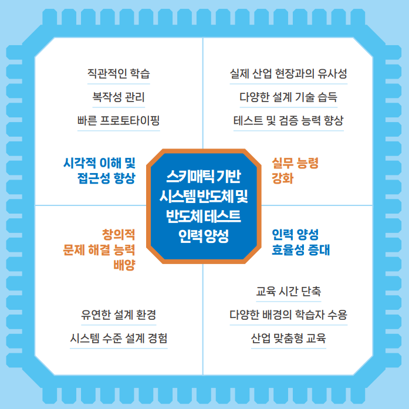
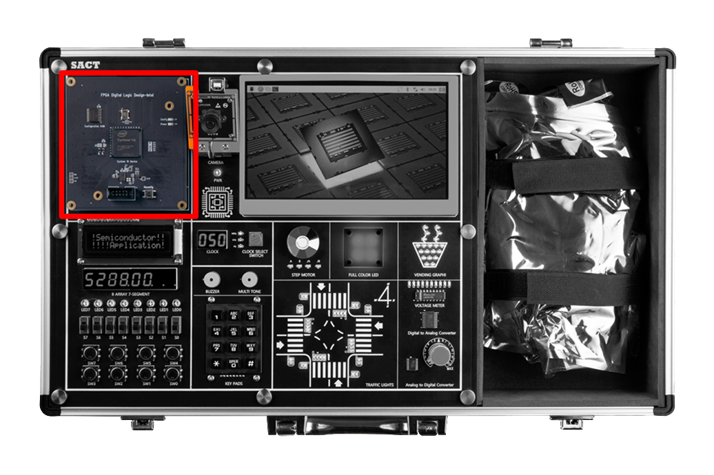
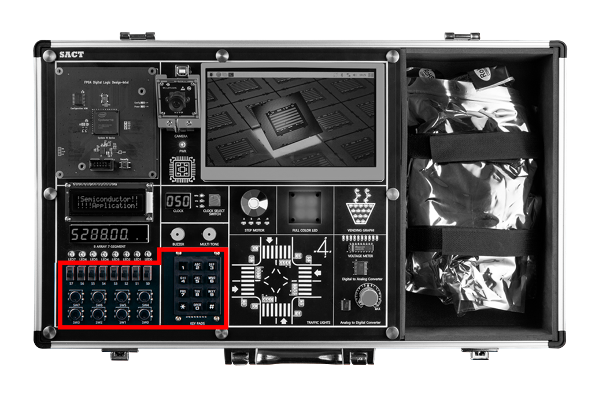
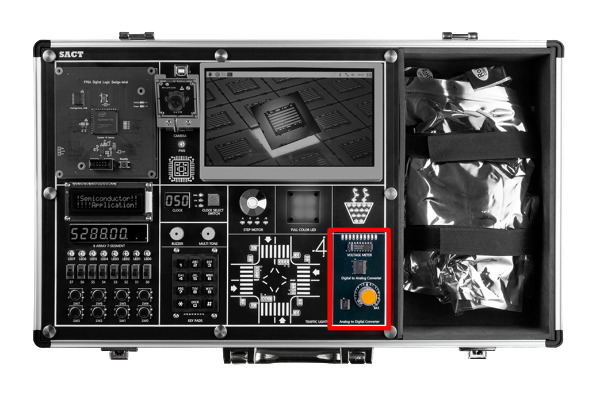
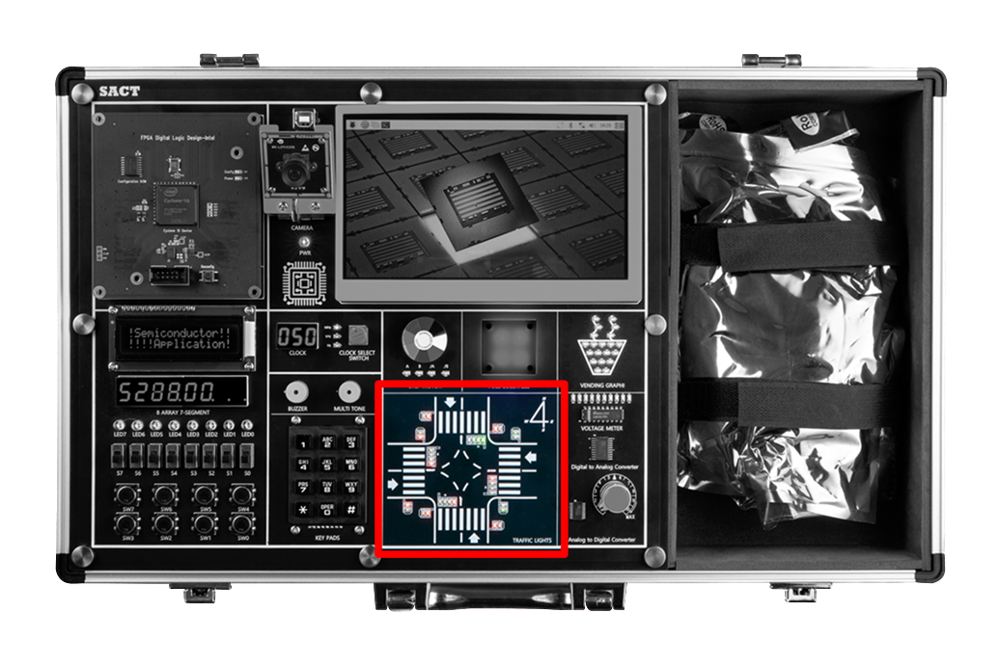
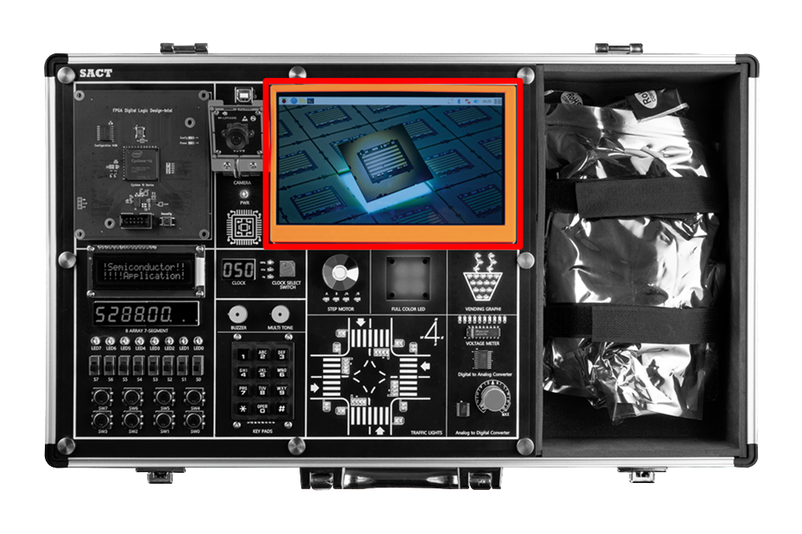

# 반도체 응용 회로 실습 장비 SACT
Hanback Electronics SACT. 

## SACT 

## 특징

SACT 장비는 아래와 같은 특징을 갖고 있다. 

- 하드웨어 동작을 자유롭게 정의할 수 있는 프로그래머블 반도체 실습장비

- 실습 지시서 운영에 필요한 터치 디스플레이와 카메라, 싱글 보드 컴퓨터(SBC) 제공

- 응용 회로 운영 클록에 필요한 16종의 클록 공급 기능 제공

- 응용 회로 실험에 필요한 주변장치(버튼, 텍스트 LCD, 키패드, 스탭모터, RGB-LED, 포텐셜미터등) 제공

- 센서 응용회로 설계 및 아날로그 신호 제어를 위해 ADC / DAC 제공

- 타이밍 분석기, 상태도 작성 도구, 시뮬레이션 환경 등 다양한 설계 툴 기반 전문적 설계 환경 제공

- 초보자도 쉽게 접근할 수 있도록 스키매틱 에디터만으로 회로 설계 지원

- 설계-구현-테스트 주기의 신속한 피드백을 통해 자신의 설계를 빠르게 검증하고 개선할 수 있음

- 설계한 회로를 빠르게 시뮬레이션하고 실습 장비에서 실험해 보는 단순화된 워크플로 제공

- 가산기, 감산기, 비교기, 멀티플렉서와 같은 주요 조합 논리 회로의 설계와 실습을 체계적으로 지원

- 래치와 플립플롭부터 레지스터와 카운터까지 점진적으로 난이도를 높여 학습

- 정밀한 타이밍 및 동기화 실습 가능

- 무어/밀리 머신과 같은 FSM 설계를 통해 복잡한 상태 기반 제어 논리 구현

- 메모리 설계 및 테스트 실습 가능

- 기본 논리 게이트부터 시작해 점진적으로 복잡한 조합 및 순차 논리 회로로 발전하도록 커리큘럼 지원

- 실제 반도체 설계 및 테스트 공정에서 사용되는 프로세스 간접 경험 가능

## 소프트웨어 환경 

- OS : Windows 10 이상

- Design Software
    - Schematic을 사용한 반도체 응용 회로 설계
    - 설계한 회로에 대한 시뮬레이션
    - 프로그래밍을 통한 하드웨어 동작 확인

## 블록 설명

- **Semiconductor Application Circuit Design Block**

    Programable Logic Device에서 사용자가 반도체 응용 회로를 설계하고, 프로그래밍하여 하드웨어 동작을 확인해 볼 수 있는 블록

    

- **Clock Control Block**

    - 반도체 응용 회로 설계에서 사용하기 위하여 0Hz에서 50MHz까지 16단계로 구성돈 클럭을 선택하여 사용.
    
    - 0Hz, 1Hz, 10Hz, 50Hz, 100Hz, 500Hz, 1kHz, 5kHz, 10kHz, 50kHz, 100kHz, 500kHz, 1MHz, 5MHz, 25MHz, 50MHz

    

- **Input**
    - Slide Switch 8ea
    - Push Button Switch 8ea	
    - 3 x 4 Keypads 1ea

    
 
- **Output**
    - Buzzer 1ea
    - Multi Tone Buzzer 1ea

    
 
- **Display**
    - 16 x 2 Text LCD
    - 4 Digit FND 2ea
    - LED 8ea
    - RGB LED 4ea 

    
  
- **Actuator**
    - Step Motor (Status LED 4ea)

    
 
- **AD/DA Convertor**
    - ADC : Parallel 8-bit, Sampling Speed 1MHz
    - DAC : Parallel 8-bit, Sampling Speed 500kHz
    - AD In : Volume Resistor(0 ~ +5V)
    - Voltage meter : 0 ~ +5V, Display LED 10ea

    
 
- **Application Block**
    - Traffic Light 
        - 32개의 LED를 이용해 네거리의 신호등을 표현 제어
        - 24개의 I/O 제어

    

    - Vending Machine Image
        - 20개의 LED를 이용해 컵에 물이 차는 모양 표시
        - 7개의 I/O 제어

    
            

- **Assistance Block**

    - x86 계열의 PC와 7인치 모니터, Camera로 구성됨.
        
    - 7인치 TFT LCD를 통해 수업 내용 표시		

    

    - Camera를 통한 AI 실험 데모

    
        

