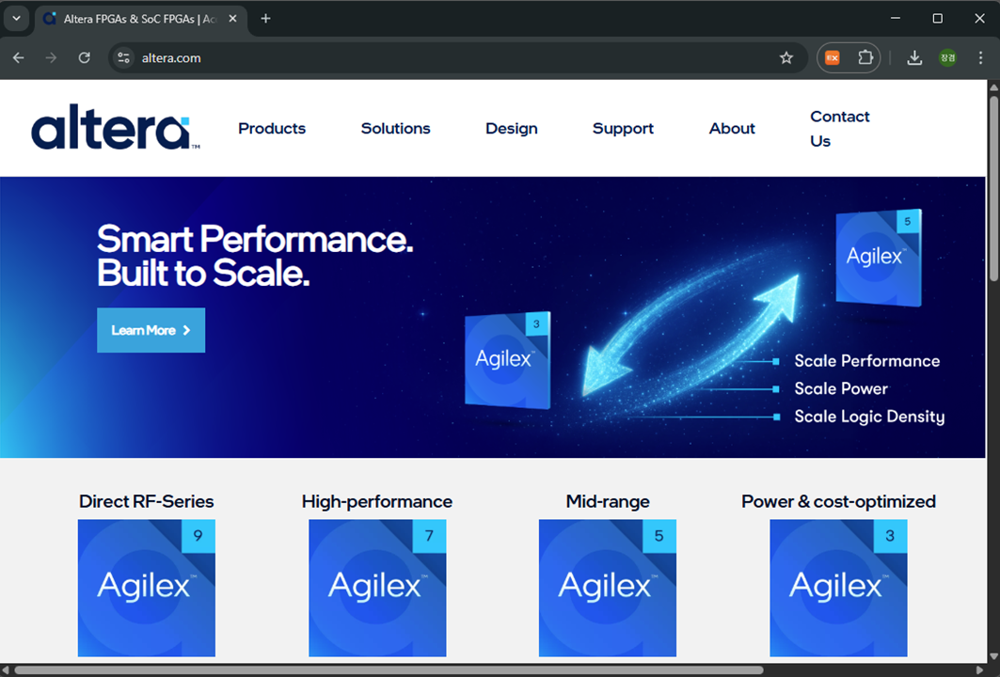

# 1.환경 설정

## 1.1. Tool Install

반도체 응용 설계 실습을 위해 사용하는 소프트웨어를 설치하는 방법입니다. 

설계 소프트웨어는 altera의 Quartus Prime 소프트웨어입니다. 

실제 FPGA의 설계 목적으로 사용하는 소프트웨어인데, 이 장비에서 반도체 응용 설계를 위한 목적으로 사용됩니다. 

(이 내용은 25년 6월에 작성되었으며, 날짜에 따라 홈페이지의 모양/접속 방법이 달라질 수 있습니다.) 

** 설치 파일 다운로드 **

1. 홈페이지에 접속합니다. [링크](https://www.altera.com)

2. 
3. 3
4. 4

수식

$2^2 + 3^2 = 13$

---

링크 걸기
[링크](https://github.com/hanback-lab/SACT)

--- 

사진 추가

