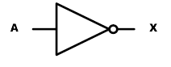
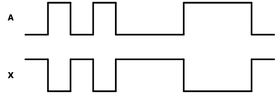

# 2.Logic Gate

## 2.1 Not Gate

### **이론**

NOT 연산은 입력 논리  값의 반대가 출력되는 연산이다. 출력 값을 입력 값의 역 또는 보수라고 말할 수도 있다.

다음 그림은 NOT 게이트의 논리 기호로 인버터(inverter)라고 부르기도 한다. 

이 회로는 항상 1개의 입력을 가지고 있으며, 출력은 입력 논리 값의 반대 값을 가지게 된다. 

즉 High의 값이 입력되면, Low의 값이 출력 된다.

NOT 연산 진리표
|A|X = /A  (not A)|
|:---:|:---:|
|0|1|
|1|0|

### **실습**
---
1. 다음의 회로를 설계하여 실험해 보자.

이 회로의 진리표은 다음과 같다. 

|A|X = /A |Y = /(/A) = A|
|:---:|:---:|:---:|
|0|1|0|
|1|0|1|

2. 실험을 위해 아래 링크를 눌러, 프로젝트 파일을 다운로드 한다. 

[NOT_Project](./_NOT/Logic_NOT.zip)

3. Quartus II를 실행키고, File > Open Project 메뉴를 선택한다. 

4. NOT