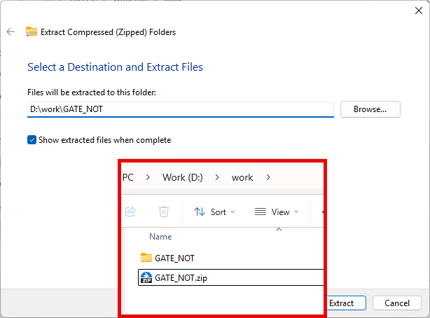

# 2.Logic Gate

## 2.1 Not Gate

### **이론**

NOT 연산은 입력 논리  값의 반대가 출력되는 연산이다. 출력 값을 입력 값의 역 또는 보수라고 말할 수도 있다.

다음 그림은 NOT 게이트의 논리 기호로 인버터(inverter)라고 부르기도 한다. 

이 회로는 항상 1개의 입력을 가지고 있으며, 출력은 입력 논리 값의 반대 값을 가지게 된다. 

즉 High의 값이 입력되면, Low의 값이 출력 된다.

NOT 연산 진리표
|A|X = /A  (not A)|
|:---:|:---:|
|0|1|
|1|0|

### **실습**
---
1. 다음의 회로를 설계하여 실험해 보자.

이 회로의 진리표은 다음과 같다. 

|A|X = /A |Y = /(/A) = A|
|:---:|:---:|:---:|
|0|1|0|
|1|0|1|

2. 실험을 위해 아래 링크를 눌러, 프로젝트 파일을 다운로드 한다. 

<a href="./pds/GATEpds.zip" download>여기를 클릭하여 프로젝트 다운로드</a>

3. 다운로드된 프로젝트의 압축 파일을 d:\work에 이동시킨 후, 압축을 푼다.

 

4. Quartus II를 실행키고, File> Open Project 메뉴를 선택한다. 

5. 위에서 압축을 푼 위치인, d:\work\GATE_NOT 폴더로 이동 후,GATE_NOT 프로젝트를 OPEN한다. 

6. File > Open 메뉴를 선택하여 GATE_NOT.bdf 파일을 불러오거나, 프로젝트 왼쪽의 GATE_NOT 부분을 마우스로 더블 클릭한다. 

7. 아래 그림과 같이 미완성된 도면이 보이는데, 1번에서 설명한 도면으로 완성시키자. 

8. 아래 그림과 같이 도면을 마우스로 더블 클릭하거나, 마우스 오른쪽 버튼을 누르고 Insert > Symbol 메뉴를 선택한다. 

9. 심볼 창에서 왼쪽 아래 부분의 -Name- 부분에 not이라고 심볼명을 입력하고, OK 버튼을 누른다. 

10. NOT 게이트 심볼을 도면에 위치시킨다. 다시 한 번 진행하여 총 2개의 심볼을 도면에 위치시킨다. 

11. 심볼의 선 분에 마우스 포인터를 가져가면 아래 그림과 같이 wire를 그리는 것으로 바뀌는데, 마우스의 드래그 & 드롭을 이용해서 회로를 완성해 보자.

회로의 Wire가 정확하게 연결되지 않았을 경우에는 원하는 동작이 되지 않을 수 있기 때문에 주의하자. 

12. File > Save 메뉴를 선택하여 저장하고, Processing > Start Compilation 메뉴를 선택하여 컴파일을 진행한다. 

이 컴파일 과정은 설계한 논리 회로에 오류가 없는 지를 검증하고, 프로그래밍 파일과 시뮬레이션 파일을 만드는 과정이다. 

13. 아래 그림은 컴파일이 진행되어 완료된 상태이다.  

