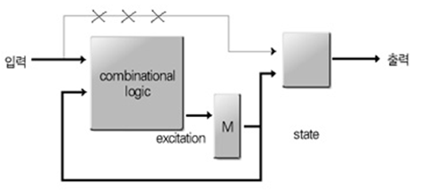

# MOD-N Counter
---

## 이론

스테이트 머신은 외부 입력과 시스템 클럭에 의해 State(상태)가 바뀌게 되고, State에 의존되어 출력 값이 결정된다. 

스테이트 머신은 Moore Machine과 Mealy Machine으로 구분한다.

이 장에서는 이 스테이트 머신에 대하여 설명하고 있다. 

 

- **Moore Machine**

Moore Machine은 현재의 상태에 의해 출력이 결정되는 스테이트 머신을 말한다. 

따라서, 데이터의 입력은 State를 바꾸는 데에만 사용되고, 결과에 영향을 미치지 않는데, 결과는 State에 의해서 결정된다.

 

이 Moore Machine은 다음 블록도와 같이 시스템이 구성된다. 

 

 

다음의 상태도는 Moore Machine의 방법으로 각 State가 바뀌고, 그에 따라 데이터가 출력하는 것을 설명하는 그림이다. 

  

---
## **실습 목표 **

다음의 회로를 설계하여 실험해 보자.

 

 

이 회로에서 아래 그림과 같이 사각형으로 표시된 부분은 MOD-6 카운터를 7-Segment에 표시하기 위해, 앞에서 실습했었던 BCD to 7-Segment 디코더와 연결하는 부분이다. 

이렇게 하면 MOD-6 카운터에서 0 ~ 5까지 카운트한 값이, 7-Segment의 1자리에 숫자로 표시된다. 

 

SACT 장비에서 확인하기 위하여 연결된 장치는 다음과 같다. 

|CLK|Q2|Q1|Q0|
|:---:|:---:|:---:|:---:|
|SW7|LED7|LED6|LED5|

 

 

### **설계**

1. 실험을 위해 프로젝트 파일 <a href="./pds/SM_MOORE.zip" download>SM_MOORE.zip</a>을 준비한다. 
 

2. 다운로드된 프로젝트의 압축 파일을 d:\work 이동시킨 후, 압축을 푼다.

3. Quartus II를 실행키고, File> Open Project 메뉴를 선택한다. 

 

4. 위에서 압축을 푼 위치인, d:\work\SM_MOORE 폴더로 이동 후,SM_MOORE 프로젝트를 OPEN한다. 

 

5. File > Open 메뉴를 선택하여 SM_MOORE.bdf 파일을 불러오거나, 프로젝트 왼쪽의 SM_MOORE 부분을 마우스로 더블 클릭한다. 

 

6. 아래 그림과 같이 미완성된 도면이 보이는데, 실습 목표에서 설명한 도면으로 완성시키자. 

 

 

7. jkff 심볼과 7448 심볼, nand2 심볼을 블러오고, wire로 심볼을 연결시켜 회로를 완성시킨다.  

 

 

### **컴파일**

8. File > Save 메뉴를 선택하여 저장하고, Processing > Start Compilation 메뉴를 선택하여 컴파일을 진행한다. 

이 컴파일 과정은 설계한 논리 회로에 오류가 없는 지를 검증하고, 프로그래밍 파일과 시뮬레이션 파일을 만드는 과정이다. 

  

### **시뮬레이션**

9. 컴파일 완료 후, File > Open 메뉴를 선택하고, 나타나는 Open File 창에서 오른쪽 아래 부분의 File Type을 All File(*.*)로 변경한 후, Wavefmom.vwf 파일을 선택한다. 

10. 아래 그림과 같이 Wavefmom 창에서, Simulation > Run Functiona Simulation 메뉴를 선택하여 Functional Simulation을 진행하여, 결과를 확인한다. 

 

 
 

### **하드웨어 동작 확인**

11. SACT 장비를 준비한다. USB 케이블과 파워 케이블을 연결하고, 전원 스위치를 눌러 장비에 전원을 인가시킨다. 

12. Quartus 소프트웨어에서 Tool > Programmer 메뉴를 선택한다.

13. Programmer창의 Hardware Setup이 USB Blaster가 연결되어 있는지 확인하고, Start 버튼을 눌러 프로그래밍 하고 장비에서 동작을 확인한다. 

 

14. 버튼 스위치와 슬라이드 스위치를 동작시키고, LED에서 결과를 확인해 보자. 

SACT 장비에서 확인하기 위하여 연결된 장치는 다음과 같다. 

|CLK|Q2|Q1|Q0|
|:---:|:---:|:---:|:---:|
|SW7|LED7|LED6|LED5|

 